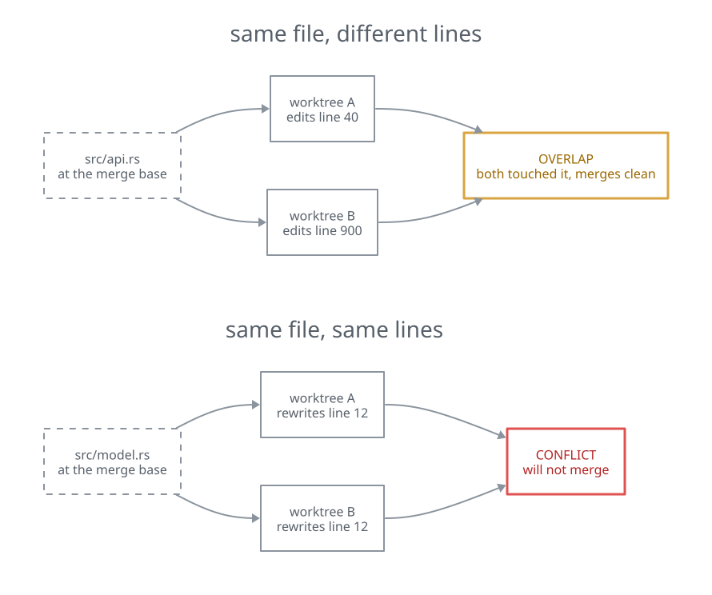
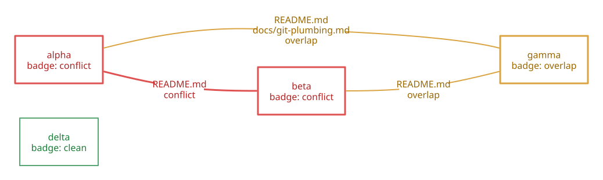
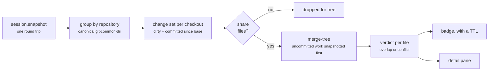

<div align="center">


# collide

**Warns you when agents working in different git worktrees of one repository are about to step on
each other — and whether their edits merely overlap or will actually conflict.**

[](https://github.com/moneycaringcoder/herdr-collide/actions/workflows/ci.yml)
[](LICENSE)
[](https://herdr.dev)
[](#how-it-works)

</div>

Running several coding agents at once usually means several git worktrees of the same repository, one
per herdr workspace. That works right up until two of them start editing the same file, and you find
out at merge time — and the more agents you run, the likelier that gets. `collide` watches every workspace that is backed by a git checkout, groups them by
repository, and tells you — while the work is still in flight — which sibling worktrees are touching
the same files, and whether those edits will merely overlap or will genuinely conflict on merge. It
also flags a *runaway* worktree whose change set has grown past a threshold you set, which is usually
the first visible sign that an agent has wandered off.

It never writes to your repositories. Every git invocation is read-only, passes `--no-optional-locks`
so it cannot contend with an agent's own git commands, and stages nothing through your real index.

## Overlap is not conflict

Most tools would stop at "you both touched `src/api.rs`". That is usually a false alarm — two
checkouts editing opposite ends of one file merge without complaint. `collide` asks git what the
merge would actually do, so a warning means something:



That check runs for **every pair of worktrees in the repository**, not just two. Six pairs for four
agents, forty-five for ten, and each workspace's badge rolls up whatever its own pairings found:



`delta` shares nothing with anybody, so it has no pairings and no badge. `gamma` overlaps two
different siblings and its badge counts both. Pairs with no files in common are dropped before any
expensive work happens, which is what keeps the comparison cheap as the number of agents grows.

## What it looks like

In the sidebar, each workspace picks up a short badge next to its branch name:

```
  api       feature/api     ✘ 2
  ui        feature/ui      ✘ 2
  docs      docs/readme     ? 1
  spike     spike/parser    ⚠ 4.2k
  vendored  vendor/import   ? 1
  deploy    chore/bump
```

`✘ 2` means two files are predicted to conflict and `⧉ 1` means one file is shared but merges cleanly.
`⚠ 4.2k` is a runaway: 4200 changed lines in one worktree, which is a count of the change set rather
than of shared files — a runaway agent is usually one that shares nothing with anybody. `? 1` is the
badge that matters most: it means `collide` could not work out an answer for that file, and it is
deliberately not folded into `⧉`, whose whole meaning is *"I checked, and it merges clean"*. A clean
workspace shows nothing at all. Numbers abbreviate once they get long — `1.2k`, `12k`, `1.2M` — so a
badge never grows wide enough to push the branch name off the row.

The full picture lives in the **Collide: shared files** overlay pane, which redraws on an interval.
Worktrees are grouped by repository, and every pairing that shares anything is listed under its group:

```
collide · shared files

repo /tmp/collide-demo/app
  api [feature/api] (no agent)  ✘ 2
  app [main] (no agent)
  docs [docs/readme] (no agent)  ? 1
  salvage [wip/salvage] (no agent)
      degraded: `wip/salvage` does not exist, so this checkout has no commit —
      left out of pairing: there is nothing to merge against.
  spike [spike/parser] (no agent)  runaway  ⚠ 4.2k
  ui [feature/ui] (no agent)  ✘ 2
  vendored [vendor/import] (no agent)  ? 1
      degraded: no common ancestor with `refs/heads/main` — so there is no range
      to measure against, and only uncommitted work is counted.

  api <-> ui
    ✘ conflict  src/collide.rs
    ✘ conflict  src/git.rs
    ⧉ overlap   src/model.rs

  api <-> vendored
    ? unknown   README.md

  docs <-> vendored
    ? unknown   README.md

  api <-> docs
    ⧉ overlap   README.md

legend
  ✘  conflict predicted on merge
  ⧉  same file, merges clean
  ?  conflict prediction unavailable
  ⚠  runaway change set (f = files)
```

That block is a capture from a real run against a six-worktree fixture, not a mock-up — which is why
`vendored` is there: it is an orphan branch with no common ancestor, so its pairings honestly say
`? unknown` rather than guessing. Pairings sort worst first, long paths are trimmed from the left so
the informative tail survives, a checkout that could only be read in part says which part and what
follows from it, and the view reflows down to very narrow panes — at 40 columns the badge is the last
thing given up, not the first.

## Install

```sh
herdr plugin install moneycaringcoder/herdr-collide
```

Installing runs the plugin's build step for you, so you end up with a compiled
`target/release/collide` and nothing further to do.

To develop against a local checkout instead:

```sh
git clone https://github.com/moneycaringcoder/herdr-collide
cd herdr-collide
cargo build --release          # required: `link` does NOT run the build step
herdr plugin link .
```

`herdr plugin link` deliberately skips the `[[build]]` hook, so the binary every command in
`herdr-plugin.toml` points at will not exist until you build it yourself. Rebuild by hand after every
change.

Removal:

```sh
herdr plugin unlink moneycaringcoder.collide
```

Logs are kept in the server rather than on disk:

```sh
herdr plugin log list --plugin moneycaringcoder.collide
```

## Required: add the tokens to your herdr config

**Nothing renders in the sidebar until you do this.** herdr's default sidebar rows do not name any of
this plugin's tokens, so a freshly installed `collide` will happily compute everything and display
none of it.

The quickest route is the bundled action — run **Collide: set up sidebar (start here)**. It splices
the rows below into your `config.toml`, takes a `config.toml.collide-backup` alongside it first, and
reloads herdr; if the reload does not come back clean it puts the backup back byte for byte.
**Collide: undo sidebar setup** restores that backup.

Setup adds only the rows your config is missing, and tells you which ones it added — so running it
again after an upgrade picks up a newly introduced token without disturbing anything else, and
running it when everything is already there does nothing at all. If you removed a row deliberately,
setup will put it back; **Collide: undo sidebar setup** reverses the whole edit. When your config is
a shape the splice cannot safely edit, it says which shape and exits non-zero rather than reporting
that there was nothing to do.

To do it by hand, add the four tokens to `[ui.sidebar.spaces]` in `~/.config/herdr/config.toml`:

```toml
[ui.sidebar.spaces]
rows = [
  ["state_icon", "workspace"],
  ["branch",
    { token = "$collide_overlap",  fg = "#FFC799" },
    { token = "$collide_runaway",  fg = "#FFB27F" },
    { token = "$collide_unknown",  fg = "#9399B2" },
    { token = "$collide_conflict", fg = "#FF8080" }],
]
```

Then reload:

```sh
herdr server reload-config
```

Sidebar rows reload live — no restart, and no losing your panes.

### Why there are four tokens instead of one

herdr renders a token's *value* as flat text and cannot colour it by content. A single
`$collide_status` token could say `✘ 2`, but it could never say it in red. So severity is encoded in
the token *name*: the plugin lights exactly one of `collide_overlap`, `collide_runaway`,
`collide_unknown` or `collide_conflict` at a time and clears the others, and each name carries its
own `fg` in your config. The `$` prefix belongs to herdr's config row syntax only; the names sent
over the wire have no `$`.

`collide_unknown` is grey rather than a warning colour on purpose. It means the plugin could not
work out an answer — a conflict prediction that failed, or a checkout git would not let it read —
and an absence of information is not a severity. It exists because the alternative is worse: before
it, a prediction that failed was rolled into the overlap badge, whose legend reads *"same file,
merges clean"*. That is not a missing answer, it is the opposite one.

There is deliberately no token for a clean workspace. A workspace with nothing to report clears its
badge instead of writing one, so its sidebar cell is empty by design — an empty cell means "no
collisions", not "the plugin is broken".

Change the colours to taste. The names must stay exactly as written, and all four should be present —
if you leave one out, workspaces at that severity simply show nothing.

## Actions and panes

| Action | What it does |
| --- | --- |
| **Collide: set up sidebar (start here)** | Adds the tokens above to `config.toml`, backs it up, reloads herdr |
| **Collide: undo sidebar setup** | Restores the backup that setup took |
| **Collide: report** | One-shot collision report for the focused repo |
| **Collide: JSON snapshot** | The same data, machine-readable, for scripting |
| **Collide: enable badge updater** | Starts the background updater that pushes badges |
| **Collide: disable badge updater** | Stops it and clears every badge this plugin set |
| **Collide: toggle badge updater** | Whichever of the two applies |

There is one pane, **Collide: shared files**, placed as an overlay. It runs the live detail view shown
above and refreshes on the configured interval. Close it the way you close any herdr overlay; it exits
cleanly on `SIGINT` and `SIGTERM` and restores the cursor on the way out.

The badge updater is off until you enable it. Once enabled it survives a herdr restart and a
`herdr update --handoff`: a startup hook re-spawns it, but only if you had it enabled when herdr went
away. Disabling it stops the updater, waits for it to finish, and then sweeps every current workspace
so no stale badge is left behind.

Everything is also available from the command line, which is handy when the plugin is misbehaving:

```
collide --once      # one-shot report
collide --json      # the same report as JSON
collide --watch     # the live detail view
collide --enable | --disable | --toggle
collide --setup | --setup-rollback
collide --interval 10 --watch
collide --base-ref origin/main --once
collide --help
```

Options may come before or after the verb, so `collide --base-ref main --once` and
`collide --once --base-ref main` are the same command.

## Configuration

Configuration is a JSON file at `$HERDR_PLUGIN_CONFIG_DIR/config.json`. herdr injects that directory
when it runs the plugin; when you run the binary yourself it resolves to the same place herdr would
use, `~/.config/herdr/plugins/config/moneycaringcoder.collide/config.json`, so both routes read one
file. The daemon's own state lives alongside it under `~/.local/state/herdr/plugins/`, which is why
`collide --disable` typed at a shell stops the updater a plugin action started. Every key is optional and overrides just that default, and unknown keys are
ignored, so a config written for a newer version will not break an older binary. A missing file is the
normal case; a malformed one prints a warning and falls back to the defaults rather than taking the
badge down.

```json
{
  "interval_seconds": 5,
  "runaway_files": 40,
  "runaway_lines": 2000,
  "ignore_suffixes": [
    "Cargo.lock",
    "package-lock.json",
    "pnpm-lock.yaml",
    "yarn.lock",
    "poetry.lock",
    "go.sum"
  ],
  "predict_conflicts": true,
  "base_ref": "origin/HEAD",
  "git_timeout_seconds": 10
}
```

- **`interval_seconds`** — how often the badge updater and the detail pane refresh. Default 5, clamped
  to 1–3600. `--interval <SECS>` overrides it for a single run.
- **`runaway_files`** / **`runaway_lines`** — a workspace is flagged as a runaway once its change set
  passes either threshold. Defaults 40 files and 2000 changed lines. The badge reports the changed-line
  count, so `runaway_lines` is also the number the `⚠` badge is measured against.
- **`ignore_suffixes`** — paths ending in any of these never count as a change. Lockfiles overlap
  constantly and mean nothing, so they are excluded by default. Setting the key replaces the whole
  list rather than adding to it.
- **`predict_conflicts`** — set to `false` to report shared paths only. Cheaper, and it stops
  distinguishing a real conflict from a plain overlap.
- **`base_ref`** — the ref each checkout's change set is measured against, as the `<base>` in
  `git diff <base>...HEAD`. Default `origin/HEAD`; where that does not resolve, `collide` falls back to
  the first of `origin/main`, `origin/master`, `main`, `master`, `trunk` that exists, and finally to
  `HEAD` — which still reports the checkout's dirty state, and only loses the committed-since-base
  half. `--base-ref <REF>` overrides it for a single run.
- **`git_timeout_seconds`** — cap on any single git invocation, so one slow repository cannot stall
  the refresh loop.

## How it works

Each cycle takes a single `session.snapshot` over herdr's socket — one round trip for every workspace,
pane, and agent at once, so nothing tears while a workspace is closing. Workspaces with no worktree
information are not repositories and are dropped. For the rest, repository identity is re-derived from
git itself rather than trusted from the snapshot — the canonicalized common git directory — and
checkouts are grouped by that, so two of them are only ever compared when they are genuinely the same
repository.

For each checkout, `collide` reads a change set — staged, unstaged, untracked, conflicted, and
committed since the merge base — with read-only git plumbing. Pairs of checkouts within a repository
are then intersected: a pair with no files in common cannot conflict and is dropped for free.
Survivors go through conflict prediction. Uncommitted work on either side is first captured as a tree
through a throwaway index, so a prediction covers what the agents have actually written rather than
only what they have committed.



There used to be a cheaper first pass here — `merge-tree --quiet` as a boolean oracle, fifteen times
faster — until it was found reporting clean for merges that genuinely conflict. It is not used at any
stage now; [docs/git-plumbing.md](docs/git-plumbing.md) records exactly when it lies.

The result is one badge per workspace, pushed with a TTL of roughly three refresh intervals. That TTL
is what makes the display self-healing: if the updater is killed, herdr expires the badges on its own
within a cycle or two rather than leaving a stale warning on screen forever.

## Limitations

Worth knowing before you trust it:

- **It polls.** herdr exposes no filesystem events, so changes are noticed on the refresh interval and
  not before. A five-second badge is a five-second-old badge.
- **Conflict prediction is a prediction.** It merges the two sides' current state in a temporary index
  and reports what git says *now*. Commit, rebase, or keep typing and the answer can change. A worktree
  with a merge already in progress is trickier still: its snapshot is staged from files that still
  contain conflict markers. The detail pane labels those pairings `advisory:` and names the side
  responsible, rather than presenting the verdict as if the trees were clean.
- **Lockfiles are ignored by default.** `Cargo.lock`, `package-lock.json`, and friends overlap in
  almost every pair of worktrees and almost never mean anything. If you want them counted, override
  `ignore_suffixes`.
- **Non-UTF-8 paths are rendered lossily.** Git reports raw bytes; anything that is not valid UTF-8,
  and anything that could take control of your terminal, is replaced before display — so such a path
  renders differently from how it appears on disk. A short digest of the original bytes is appended
  so that two files whose names differ only in the replaced part stay distinct, rather than being
  reported as one file both worktrees changed.
- **Content filters are not run.** `git add` would otherwise execute whatever `filter.*.clean` or
  `filter.*.process` program your repository configures, on every refresh — and for git-lfs that
  writes into your own `.git/lfs`, which is not something a read-only tool may do. They are disabled
  for the snapshot instead. The consequence is that a filtered file is compared as its raw bytes: for
  git-lfs that changes nothing useful, and for a filter that rewrites text it makes that file's line
  count reflect the unfiltered content.
- **A dirty submodule is seen but its contents are not compared.** It shows up as one changed path,
  but the snapshot records the submodule's committed pointer rather than its contents. When
  merge-tree finds no gitlink conflict, modified or untracked content inside it makes the verdict
  `? unknown` rather than a clean overlap, because no clean merge of those contents was checked. A
  change to the recorded pointer is still compared normally and can still report a conflict, even
  when the submodule contents are also dirty. Work inside the submodule is also invisible to the
  runaway thresholds.
- **A checkout can be readable only in part.** An unborn branch, a branch deleted underneath a
  worktree, a base ref that does not resolve, or two histories with no common ancestor all limit what
  can be compared. Rather than quietly reporting such a checkout as clean, the detail pane marks it
  `degraded:` and states which of those it was and what the consequence is — excluded from pairing, or
  counted on uncommitted work only. A pair whose prediction could not run is shown as `? unknown`
  instead of being downgraded to a plain overlap, and the workspace badges `?` rather than going
  quiet. Two histories with no common ancestor are refused outright rather than guessed at: there is
  no merge to predict, so the answer is "cannot tell" and not "everything conflicts".
- **Linux and macOS only.** The daemon relies on Unix process and signal behaviour, and the plugin
  declares those two platforms.
- **Repository identity across linked worktrees is observed rather than specified.** It holds for
  ordinary `git worktree` layouts; submodules and `--separate-git-dir` setups are less well tested.

## Contributing

Bug reports, questions, documentation fixes and code are all welcome — see
[CONTRIBUTING.md](CONTRIBUTING.md) for how to build it, what makes a change
easy to merge, and what is deliberately out of scope. The project is maintained
by one person, so review is careful rather than instant.

The one rule worth knowing up front: collide is strictly read-only against your
repositories, and `tests/read_only.rs` enforces that by fingerprinting every
index, ref and object before and after a run.

Security issues go through [private reporting](SECURITY.md) rather than public
issues.

## Licence

MIT. See [LICENSE](LICENSE).
